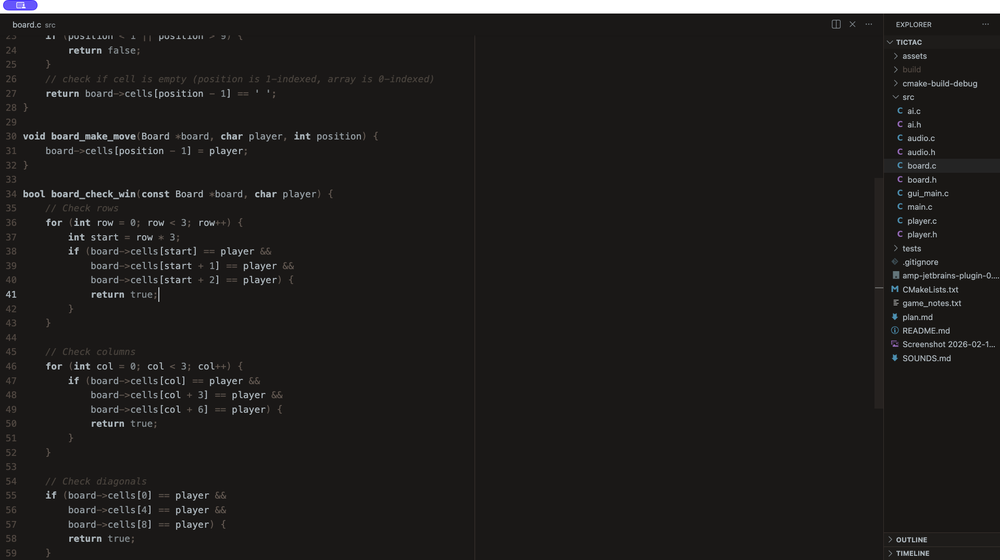
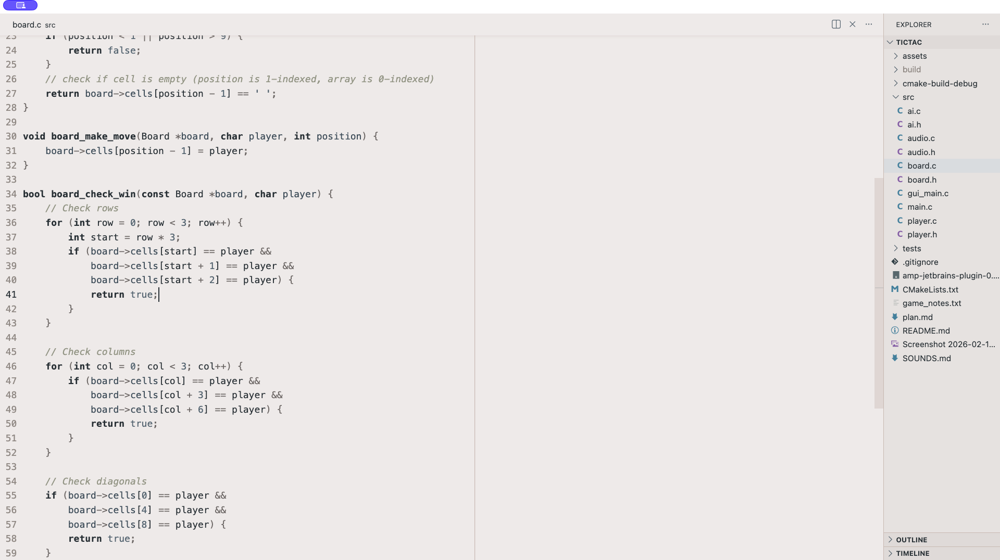

# Zenbones Redux for Visual Studio Code

A contrast-based color theme for Visual Studio Code, ported from the popular [Zenbones](https://github.com/zenbones-theme/zenbones.nvim) Neovim colorscheme.






## Philosophy

Zenbones highlights code using **contrasts and font variations**, not colors. Colors are reserved for other roles: diagnostics, diffs, search matches, and git decorations. This creates a calm, readable editing experience that lets the structure of your code speak through typography.

> *"A rock garden in Ryōan-ji"* - The theme draws inspiration from the simplicity of zen aesthetics.

## Variants

| Variant | Background | Style |
|---------|-----------|-------|
| **Zenbones Light** | Warm sand (`#F0EDEC`) | Light theme with stone-toned foreground |
| **Zenbones Dark** | Dark sand (`#1C1917`) | Dark theme with cool stone foreground |

## Color Palette

Six named accent colors are used exclusively for UI roles (never for syntax):

| Name | Light | Dark | Role |
|------|-------|------|------|
| Rose | `#A8334C` | `#DE6E7C` | Errors, deletions |
| Leaf | `#4F6C31` | `#819B69` | Success, additions |
| Wood | `#944927` | `#B77E64` | Warnings |
| Water | `#286486` | `#6099C0` | Info, links |
| Blossom | `#88507D` | `#B279A7` | Hints, search, regex |
| Sky | `#3B8992` | `#66A5AD` | Cyan accents |

## Installation

### From Marketplace

1. Open VSCode
2. Go to Extensions (`Ctrl+Shift+X` / `Cmd+Shift+X`)
3. Search for "Zenbones Redux"
4. Click Install
5. Select the theme: `Ctrl+K Ctrl+T` / `Cmd+K Cmd+T` and choose **Zenbones Light** or **Zenbones Dark**

### Manual Installation

1. Clone or download this repository
2. Copy the folder to your VSCode extensions directory:
   - **macOS**: `~/.vscode/extensions/`
   - **Linux**: `~/.vscode/extensions/`
   - **Windows**: `%USERPROFILE%\.vscode\extensions\`
3. Restart VSCode
4. Select the theme via `Ctrl+K Ctrl+T` / `Cmd+K Cmd+T`

### From VSIX

```sh
npm install -g @vscode/vsce
vsce package
code --install-extension zenbones-redux-1.0.1.vsix
```

## Recommended Settings

For the full Zenbones experience, use a font with good bold and italic support:

```json
{
  "editor.fontFamily": "'JetBrains Mono', 'Fira Code', Menlo, monospace",
  "editor.fontLigatures": true,
  "editor.bracketPairColorization.enabled": true
}
```

## Credits

This is an unofficial VSCode port of the [zenbones.nvim](https://github.com/zenbones-theme/zenbones.nvim) colorscheme by [mcchrish](https://github.com/mcchrish). All color values are derived from the original theme.

Zenbones is inspired by [Verdandi](https://github.com/be5invis/vsc-theme-verdandi) and [vim-yin-yang](https://github.com/pgdouyon/vim-yin-yang).

## License

[MIT](LICENSE)
